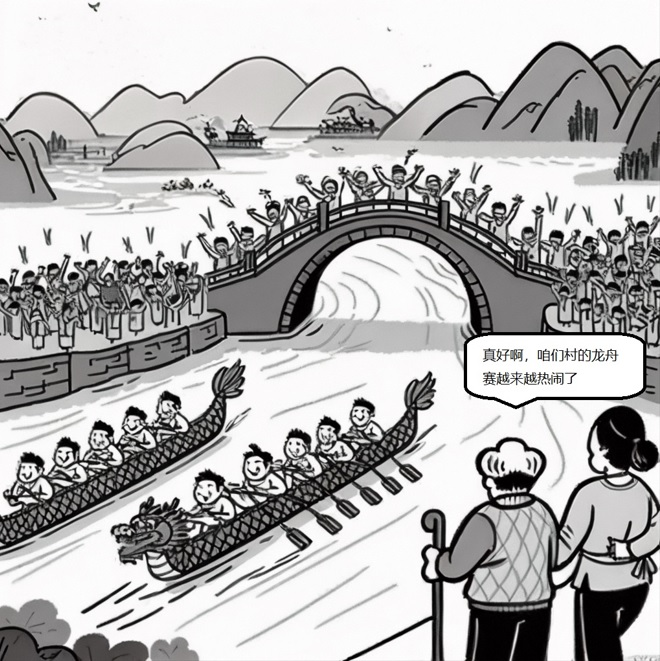

# 2023 年考研英语（一）Part B

## Original Prompt

**Directions:**

Write an essay based on the picture below. In your essay, you should

1. describe the picture briefly,
2. interpret the implied meaning, and
3. give your comments.

Write your answer in 160-200 words on the ANSWER SHEET. (20 points)

## Visual Material

## Searchable Transcription

- 场景：两支龙舟队在河上比赛，桥上和岸边聚集了大量观众。
- 前景人物说：`真好啊，咱们村的龙舟赛越来越热闹了`

> 本节是检索辅助转录，正式审题时以原图为准。
