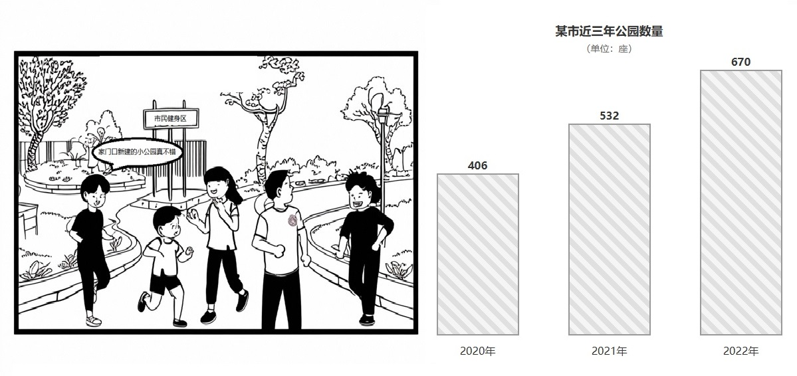

# 2024 年考研英语（一）Part B

## Original Prompt

**Directions:**

Write an essay based on the picture and the chart below. In your essay, you should

1. describe the picture and the chart briefly,
2. interpret the implied meaning, and
3. give your comments.

Write your answer in 160-200 words on the ANSWER SHEET. (20 points)

## Visual Material

## Searchable Transcription

### 图画

- 场景：市民在新建的社区公园内跑步、散步和交谈。
- 公园标牌：`市民健身区`
- 画中人物说：`家门口新建的小公园真不错`

### 图表

**图表标题：** 某市近三年公园数量（单位：座）

| 年份 | 公园数量 |
| ---: | ---: |
| 2020 | 406 |
| 2021 | 532 |
| 2022 | 670 |

> 本节是检索辅助转录，正式审题时以原图为准。
