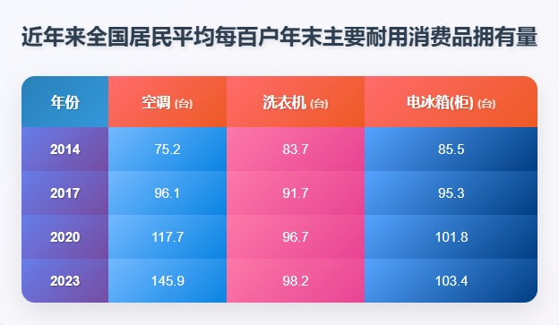

# 2025 年考研英语（一）Part B

## Original Prompt

**Directions:**

Write an essay based on the table below. In your essay, you should

1. describe the table briefly,
2. interpret the table, and
3. give your comments.

Write your answer in 160-200 words on the ANSWER SHEET. (20 points)

## Visual Material

## Searchable Transcription

**图表标题：** 近年来全国居民平均每百户年末主要耐用消费品拥有量

| 年份 | 空调（台） | 洗衣机（台） | 电冰箱（柜）（台） |
| ---: | ---: | ---: | ---: |
| 2014 | 75.2 | 83.7 | 85.5 |
| 2017 | 96.1 | 91.7 | 95.3 |
| 2020 | 117.7 | 96.7 | 101.8 |
| 2023 | 145.9 | 98.2 | 103.4 |

> 本节是检索辅助转录，正式审题时以原图为准。
