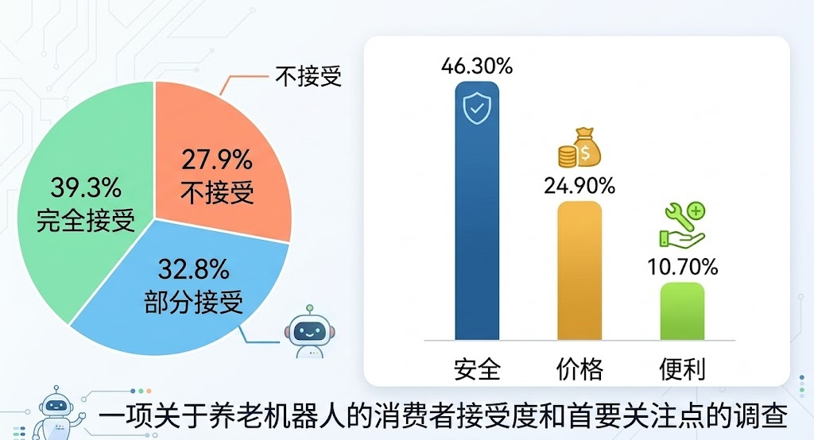

# 2026 年考研英语（一）Part B

## Original Prompt

**Directions:**

Write an essay based on the charts below. In your essay, you should

1. describe the charts briefly,
2. interpret the charts, and
3. give your comments.

Write your answer in 160-200 words on the ANSWER SHEET. (20 points)

## Visual Material

## Searchable Transcription

**图表标题：** 一项关于养老机器人的消费者接受度和首要关注点的调查

### 消费者接受度

| 态度 | 比例 |
| --- | ---: |
| 完全接受 | 39.3% |
| 部分接受 | 32.8% |
| 不接受 | 27.9% |

### 首要关注点

| 关注点 | 比例 |
| --- | ---: |
| 安全 | 46.30% |
| 价格 | 24.90% |
| 便利 | 10.70% |

> 本节是检索辅助转录，正式审题时以原图为准。
