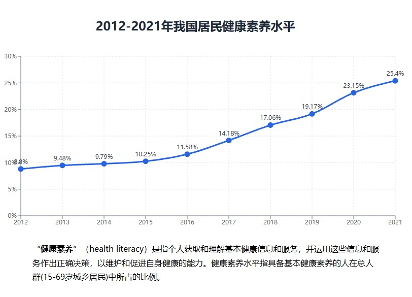

# 2023 年考研英语（二）Part B

## Original Prompt

**Directions:**

Write an essay based on the chart below. In your essay, you should

1. describe and interpret the chart, and
2. give your comments.

Write your answer in about 150 words on the ANSWER SHEET. (15 points)

## Visual Material

## Searchable Transcription

**图表标题：** 2012-2021 年我国居民健康素养水平

| 年份 | 居民健康素养水平 |
| ---: | ---: |
| 2012 | 8.8% |
| 2013 | 9.48% |
| 2014 | 9.79% |
| 2015 | 10.25% |
| 2016 | 11.58% |
| 2017 | 14.18% |
| 2018 | 17.06% |
| 2019 | 19.17% |
| 2020 | 23.15% |
| 2021 | 25.4% |

**图下注释：** “健康素养”（health literacy）是指个人获取和理解基本健康信息和服务，并运用这些信息和服务作出正确决策，以维护和促进自身健康的能力。健康素养水平指具备基本健康素养的人在总人群（15-69 岁城乡居民）中所占的比例。

> 本节是检索辅助转录，正式审题时以原图为准。
