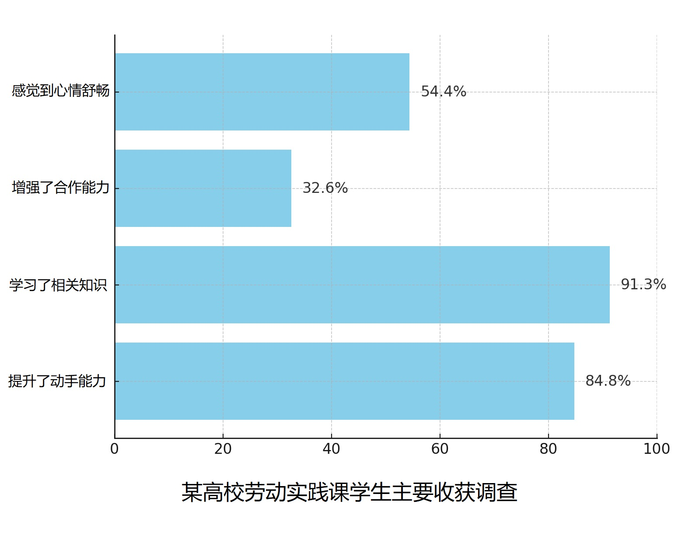

# 2024 年考研英语（二）Part B

## Original Prompt

**Directions:**

Write an essay based on the chart below. In your essay, you should

1. describe and interpret the chart, and
2. give your comments.

Write your answer in about 150 words on the ANSWER SHEET. (15 points)

## Visual Material

## Searchable Transcription

**图表标题：** 某高校劳动实践课学生主要收获调查

| 主要收获 | 比例 |
| --- | ---: |
| 学习了相关知识 | 91.3% |
| 提升了动手能力 | 84.8% |
| 感觉到心情舒畅 | 54.4% |
| 增强了合作能力 | 32.6% |

> 本节是检索辅助转录，正式审题时以原图为准。
