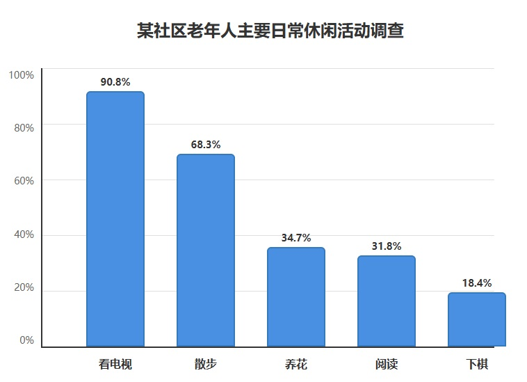

# 2025 年考研英语（二）Part B

## Original Prompt

**Directions:**

Write an essay based on the chart below. In your essay, you should

1. describe and interpret the chart, and
2. give your comments.

Write your answer in about 150 words on the ANSWER SHEET. (15 points)

## Visual Material

## Searchable Transcription

**图表标题：** 某社区老年人主要日常休闲活动调查

| 休闲活动 | 参与比例 |
| --- | ---: |
| 看电视 | 90.8% |
| 散步 | 68.3% |
| 养花 | 34.7% |
| 阅读 | 31.8% |
| 下棋 | 18.4% |

> 本节是检索辅助转录，正式审题时以原图为准。
