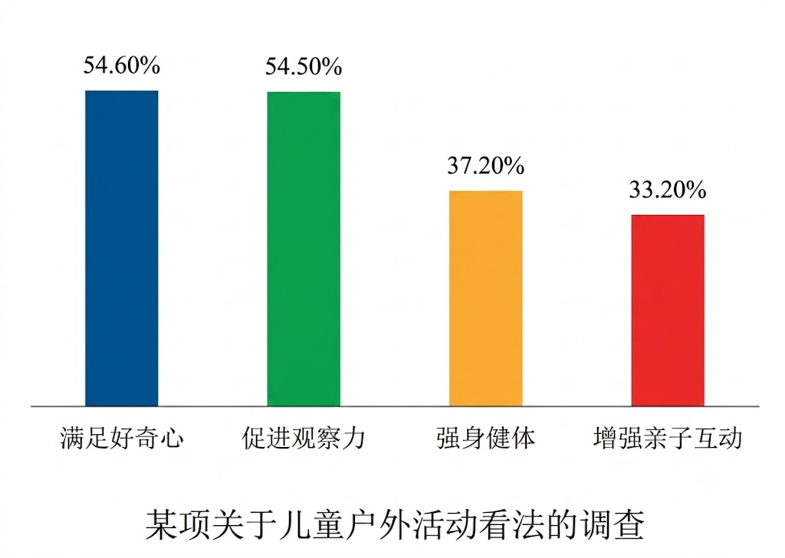

# 2026 年考研英语（二）Part B

## Original Prompt

**Directions:**

Write an essay based on the chart below. In your essay, you should

1. describe and interpret the chart, and
2. give your comments.

Write your answer in about 150 words on the ANSWER SHEET. (15 points)

## Visual Material

## Searchable Transcription

**图表标题：** 某项关于儿童户外活动看法的调查

| 对儿童户外活动的看法 | 比例 |
| --- | ---: |
| 满足好奇心 | 54.60% |
| 促进观察力 | 54.50% |
| 强身健体 | 37.20% |
| 增强亲子互动 | 33.20% |

> 本节是检索辅助转录，正式审题时以原图为准。
